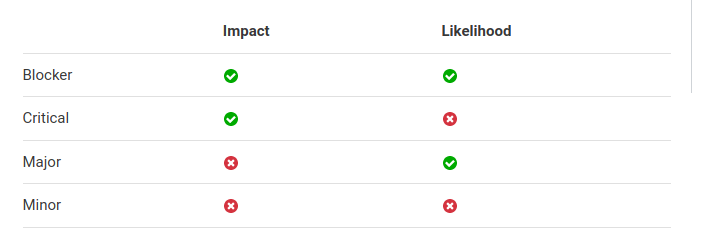

# Règles Sonar

## Rappels Sonar

SonarQube est un outil de revue de code automatique

Types de règles :
- **Bugs** (concerne la fiabilité) : code qui est manisfestement erroné, qui pourrait faire planter l'application, ou corrompre les données
- **Vulnerabilities** (concerne la sécurité) : code qui pourrait être exploité par un pirate
- **Code Smells** (concerne la maintenabilité) : code qui pourrait conduire un maintenicien à introduire à un bug
- **Security Hotspots** (concerne la sécurité) : aucune sévérité pour ces types de règles, car ce sont des points qui doivent être analysés par un humain, qui peut alors identifier ou non une vulnérabilité

Sévérité des règles :




## Strings and Boxed types should be compared using equals

- https://rules.sonarsource.com/java/RSPEC-4973
- c'est presque toujours une erreur de comparer deux instances de String ou de Boxes types (Integer, Long...) en utilisant l'égalité de référence `==` ou `!=`, car il ne s'agit pas de comparer une valeur réelle mais des emplacements en mémoire
- bug majeur (catégorie 3/4)
- 1378 cas sur les projets sur Sonar Insee

```java		
String chaine1 = new String("toto");
String chaine2 = new String("toto");
// compare les objets avec la définition de leur méthode equals
boolean compar1 = chaine1.equals(chaine2);
System.out.println("comparaison avec equals : " + compar1); // true
// compare les références des objets
boolean compar2 = chaine1 == chaine2;
System.out.println("comparaison avec == : " + compar2); // false

// pour que la comparaison == donne true,
// il faut que les 2 objets fassent référence à la même instance
String chaine3 = "toto";
String chaine4 = chaine3;
boolean compar3 = chaine3 == chaine4;
System.out.println("comparaison même objet avec == : " + compar3); // true
```


## Resources should be closed

- https://rules.sonarsource.com/java/RSPEC-2095
- les connexions, fichiers, et autres classes qui implémentent l'interface `Closeable` ou `AutoCloseable`, doivent être fermées après usage afin de libérer les ressources qui lui sont allouées
- cet appel de fermeture doit être effectué dans un bloc final, sinon une exception pourrait empêcher l'appel d'être effectué
- de préférence, lorsque la classe implémente AutoCloseable, la ressource doit être créée en utilisant le modèle "try-with-resources" et sera fermée automatiquement
- bug bloquant, catégorie la plus grave de Sonar
- 1708 cas sur les projets sur Sonar Insee


### Exemples avec un BufferedReader

```java
// NON CONFORME
Path path = Paths.get("...");
BufferedReader reader = Files.newBufferedReader(path);
String line;
while ((line = reader.readLine()) != null) {
	System.out.println(line);
}
reader.close();
```

```java
// CONFORME mais "compliqué"
Path path = Paths.get("...");
BufferedReader reader = null;
try {
	reader = Files.newBufferedReader(path);
	String line;
	while ((line = reader.readLine()) != null) {
		System.out.println(line);
	}
} catch (Exception e) {
	// ...
} finally {
	if (reader != null) {
		try {
			reader.close();
		} catch (IOException e) {
			// ignoré
		}
	}
}
```

```java
// CONFORME et plus simple
Path path = Paths.get("...");
try (BufferedReader reader = Files.newBufferedReader(path)) {
	String line;
	while ((line = reader.readLine()) != null) {
		System.out.println(line);
	}
} catch (Exception e) {
	// ...
}
```

### Exemples avec JDBC

```java
// Exemple simple sans paramètres
try (Connection connection = dataSource.getConnection();
		PreparedStatement ps = connection.prepareStatement("SELECT * FROM table");
		ResultSet rs = ps.executeQuery();) {
	while (rs.next()) {
		// ...
	}
} catch (Exception e) {
	// ...
}

// Exemple avec double try-with-resources pour paramétrer le PreparedStatement
try (Connection connection = dataSource.getConnection();
		PreparedStatement ps = connection.prepareStatement("SELECT * FROM table WHERE code = ?");) {
	ps.setString(1, "AZE");
	try (ResultSet rs = ps.executeQuery()) {
		while (rs.next()) {
			// ...
		}
	}
} catch (Exception e) {
	// ...
}
```